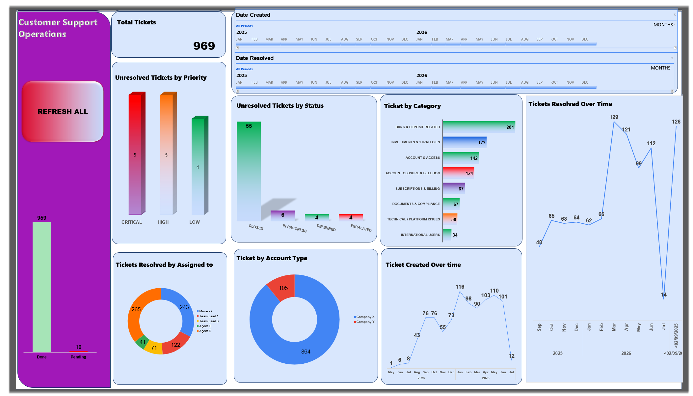

# Customer Support Operations Dashboard

## Tech Stack

- Microsoft Excel
- VBA
- PivotTables
- PivotCharts
- Data Validation
- Conditional Formatting
- Timeline Filters
> An Excel-based operations management solution designed to organize customer support tickets, automate ticket prioritization, streamline engineering workflows, and provide management with actionable support performance insights.

## Dashboard Preview

 
---

## Business Problem

As the volume of customer support requests increased, the engineering team found it increasingly difficult to prioritize unresolved issues and manage support workloads efficiently. Tickets were received through multiple communication channels, including Discord, email, and Jira, making it challenging to maintain a structured workflow for issue tracking and follow-ups.

Although customer requests originated through multiple communication channels, every issue was logged and tracked in Jira, which served as the single source of truth for ticket management and reporting.

Without a standardized process, engineers could become overwhelmed by the growing backlog, while management lacked clear visibility into ticket resolution performance and outstanding issues

Recognizing this operational challenge during the early stages of my data analytics journey, I designed and developed an Excel-based Customer Support Operations Dashboard to organize support tickets, automate prioritization, improve reporting, and provide visibility into support performance.

---

## Project Objectives

The primary objective of this project was to design a structured support operations management system that would simplify ticket tracking, improve engineering workflow, and provide management with clear visibility into customer support performance.

Specifically, the solution was designed to:

- Organize customer support tickets into standardized issue categories.
- Prioritize unresolved tickets based on business impact (Critical, High, and Low).
- Monitor ticket status throughout the resolution lifecycle.
- Track ticket creation and resolution trends over time.
- Measure team performance using operational KPIs.
- Reduce the manual effort required to prepare reports for engineering teams.
- Improve visibility into unresolved issues and overall support operations.

---

## Solution Overview

To address the operational challenges faced by the support and engineering teams, I designed and developed an Excel-based operations management system that combined structured data management, automation, and interactive reporting into a single solution.

The workflow began with support tickets logged in Jira, where every customer issue was tracked throughout its lifecycle. These records were exported and organized into a structured Excel dataset, where tickets were categorized into eight operational groups and assigned business priorities based on urgency.

Using PivotTables, PivotCharts, Conditional Formatting, Timelines, and VBA automation, I created an interactive dashboard that enabled both management and engineering teams to monitor ticket performance, identify unresolved issues, and prioritize work more effectively.

The solution transformed a manual reporting process into a structured workflow that improved ticket visibility, simplified engineering prioritization, and provided leadership with clear operational insights.

---

## Dashboard Capabilities

The dashboard was designed to provide both operational visibility and actionable insights for the support and engineering teams. Key features include:

- Interactive dashboard with timeline filters for ticket creation and resolution dates.
- Interactive KPI monitoring for total tickets, resolved tickets, pending tickets, and resolution trends.
- Ticket categorization into eight operational groups:
  - Bank & Deposit Related
  - Investments & Strategies
  - Account & Access
  - Account Closure & Deletion
  - Subscriptions & Billing
  - Documents & Compliance
  - Technical / Platform Issues
  - International Users
- Priority monitoring for Critical, High, and Low priority unresolved tickets.
- Ticket status monitoring across Closed, In Progress, Deferred, Escalated, and Pending tickets.
- Ticket distribution by account type.
- Ticket resolution performance by assigned support team member.
- Monthly ticket creation and ticket resolution trend analysis.

- ---

## VBA Automation

To improve the efficiency of the support workflow, I developed two VBA macros that automated repetitive operational tasks and reduced the manual effort required to prepare engineering reports.

###  Macro 1 – Ticket Prioritization

The first VBA macro automatically sorts unresolved tickets using a three-level prioritization logic:

1. **Priority** (Critical → High → Low)
2. **Ticket Status** (Escalated → In Progress → Pending/Deferred → Resolved → Closed)
3. **Ticket Number** (Oldest unresolved ticket first)

This ensured that engineers always received a structured list of tickets, beginning with the highest-priority unresolved issues while also considering ticket age. The workflow helped prevent important tickets from being overlooked and made daily engineering follow-ups significantly more organized.

### Macro 2 – Dashboard Refresh

The second VBA macro refreshes all PivotTables, PivotCharts, and dashboard metrics with a single click, ensuring that management always has access to the latest ticket performance data without manually updating each report.

---

## Business Impact

This solution transformed a largely manual support tracking process into a structured operational workflow.
The solution improved day-to-day operational efficiency by introducing a repeatable and standardized approach to ticket management and engineering prioritization.

Key improvements included:

- Standardized ticket categorization across multiple support issue types.
- Reduced the manual effort required to prepare engineering worklists.
- Enabled engineers to focus on the highest-priority unresolved tickets first.
- Improved visibility into ticket resolution performance through interactive dashboards and KPIs.
- Simplified management reporting using automated dashboard refresh and ticket prioritization.
- Created a repeatable process for monitoring ticket backlog and monthly support performance.

  ---

## Key Insights

The dashboard enables management and engineering teams to quickly identify operational trends, including:

- Overall ticket volume and monthly support demand.
- Resolution performance across different time periods.
- Categories generating the highest number of support requests.
- Distribution of tickets by account type.
- Team member workload and ticket resolution activity.
- Outstanding Critical, High, and Low priority tickets requiring immediate attention.
- Ticket status distribution across Escalated, In Progress, Deferred, Resolved, and Closed tickets.
- Overall support backlog and operational performance.

---

---

## Skills Demonstrated

- Data Cleaning
- Data Validation
- Dashboard Design
- Data Visualization
- KPI Reporting
- PivotTables & PivotCharts
- VBA Automation
- Conditional Formatting
- Business Process Analysis
- Workflow Optimization
- Stakeholder Reporting

### Repository Contents

| File | Description |
|------|-------------|
| `customer-support-operations-dashboard.xlsm` | Interactive Excel dashboard featuring VBA automation, Data Validation, PivotTables, PivotCharts, Conditional Formatting, KPI reporting, and workflow automation. |
| `dashboard-overview.png` | Screenshot of the completed dashboard. |
| `README.md` | Project overview, business problem, implementation approach, key insights, and documentation. |
---

## Future Improvements

Future enhancements planned for this project include:

- Rebuilding the solution in Power BI with enhanced interactivity.
- Creating drill-through pages for detailed ticket analysis.
- Developing advanced DAX measures for deeper operational insights.
- Introducing dynamic tooltips and bookmarks.
- Expanding KPI reporting for management decision-making.

  ---

## About This Project

This project is based on a real customer support operations workflow that I designed to improve ticket organization, prioritization, and reporting.

To protect confidentiality, all company names, employee names, customer information, issue summaries, and other sensitive operational details have been anonymized or modified. Although the data has been sanitized, the dashboard structure, workflow logic, VBA automation, and reporting process accurately represent the original solution.

This project represents one of my earliest data analytics projects and demonstrates how I applied Excel and VBA to solve a real business problem before expanding my skills into SQL, Power BI, and data visualization.
